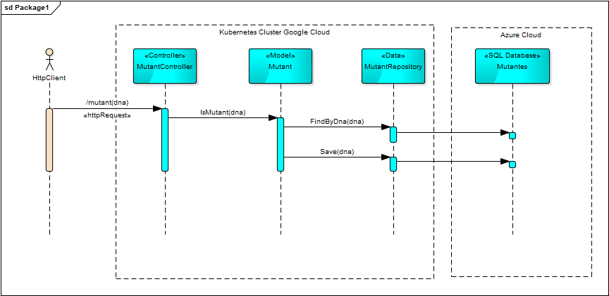

# API Mutantes

## Ejecución de la api

Ejemplos de ejecución de la api

> Base url api-mutantes http://35.223.243.79

```powershell
##Estadísticas
Invoke-WebRequest -Uri http://35.223.243.79/stats

##Ejemplo para adn de humano
Invoke-WebRequest -Method POST -Uri http://35.223.243.79/mutant -Headers @{"Content-Type" = "application/json"} -Body "{""dna"" : [""ATGCGA"",""CAGTGC"",""TTATTT"",""AGACGG"",""GCGTCA"",""TCACTG""]}"

##Ejemplo para adn de mutante
Invoke-WebRequest -Method POST -Uri http://35.223.243.79/mutant -Headers @{"Content-Type" = "application/json"} -Body "{""dna"" : [""ATGCGA"",""CAGTGC"",""TTATGT"",""AGGAGG"",""CCCCTA"",""TCACTG""]}"
```

## Diagrama de sequencia




## Análisis de cobertura de código

[Summary - Coverage Report.pdf](./Summary%20-%20Coverage%20Report.pdf)

```powershell
#Ejecución de todos los test en la solución
dotnet test .\Mutants.sln --results-directory:.\Test

#Ejecución de test unitarios
dotnet test .\Mutants.Testing.Unit\ --results-directory:.\Test --collect:"Code Coverage"

#Conversión de *.coverage a xml
& "$env:userprofile\.nuget\packages\microsoft.codecoverage\16.4.0\build\netstandard1.0\CodeCoverage\CodeCoverage.exe" analyze /output:.\Test\UnitTesting.coveragexml  .\Test\d1c5a5b8-76c5-4288-8150-34b2bffbbf0f\AZ22207_SP000LP796_2020-01-16.20_34_52.coverage

#Instalo la herramienta global reportgenerator
dotnet tool install --global dotnet-reportgenerator-globaltool --version 4.4.0

#Generación de reporte html de cobertura
reportgenerator "-reports:UnitTesting.coveragexml" "-targetdir:.\Html" -reporttypes:Html
```